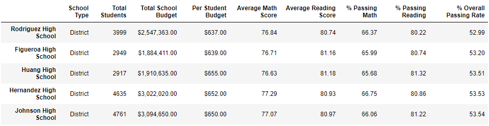
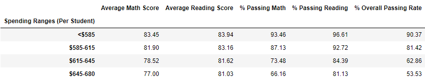

# Pandas-challenge

# PyCitySchools

## Background

Well done! Having spent years analyzing financial records for big banks, you've finally scratched your idealistic itch and joined the education sector. In your latest role, you've become the Chief Data Scientist for your city's school district. In this capacity, you'll be helping the  school board and mayor make strategic decisions regarding future school budgets and priorities.

As a first task, you've been asked to analyze the district-wide standardized test results. You'll be given access to every student's math and reading scores, as well as various information on the schools they attend. Your responsibility is to aggregate the data to and showcase obvious trends in school performance.

## Objectives

### District Summary

* Create a high level snapshot (in table form) of the district's key metrics, including:
  * Total Schools
  * Total Students
  * Total Budget
  * Average Math Score
  * Average Reading Score
  * % Passing Math (The percentage of students that passed math.)
  * % Passing Reading (The percentage of students that passed reading.)
  * % Overall Passing (The percentage of students that passed math **and** reading.)

* Results

### School Summary

* Create an overview table that summarizes key metrics about each school, including:
  * School Name
  * School Type
  * Total Students
  * Total School Budget
  * Per Student Budget
  * Average Math Score
  * Average Reading Score
  * % Passing Math (The percentage of students that passed math.)
  * % Passing Reading (The percentage of students that passed reading.)
  * % Overall Passing (The percentage of students that passed math **and** reading.)

* Results (First 5 lines)

### Top Performing Schools (By % Overall Passing)

* Create a table that highlights the top 5 performing schools based on % Overall Passing. Include:
  * School Name
  * School Type
  * Total Students
  * Total School Budget
  * Per Student Budget
  * Average Math Score
  * Average Reading Score
  * % Passing Math (The percentage of students that passed math.)
  * % Passing Reading (The percentage of students that passed reading.)
  * % Overall Passing (The percentage of students that passed math **and** reading.)

* Results

### Bottom Performing Schools (By % Overall Passing)

* Create a table that highlights the bottom 5 performing schools based on % Overall Passing. Include all of the same metrics as above.

* Results

### Math Scores by Grade

* Create a table that lists the average Math Score for students of each grade level (9th, 10th, 11th, 12th) at each school.

* Results

### Reading Scores by Grade

* Create a table that lists the average Reading Score for students of each grade level (9th, 10th, 11th, 12th) at each school.

* Results

### Scores by School Spending

* Create a table that breaks down school performances based on average Spending Ranges (Per Student). Include in the table each of the following:
  * Average Math Score
  * Average Reading Score
  * % Passing Math (The percentage of students that passed math.)
  * % Passing Reading (The percentage of students that passed reading.)
  * % Overall Passing (The percentage of students that passed math **and** reading.)

* Results

### Scores by School Size

* Repeat the above breakdown, but this time group schools based on a reasonable approximation of school size (Small, Medium, Large).

* Results

### Scores by School Type

* Repeat the above breakdown, but this time group schools based on school type (Charter vs. District).

* Results

## PyCitySchools Analysis

* Top 5 performing schools have in average a lower budget per student that the bottom 5 performing schools suggesting that the lower performance is not necessarily monetary related.

* Math and reading score data by grade does not reveal any significant variance or trends as they appear consistent across schools.

* The overall passing rate shows that top performing schools were small to medium sized charter schools and the bottom performing schools were large, district schools.

### Copyright

Trilogy Education Services © 2019. All Rights Reserved.
